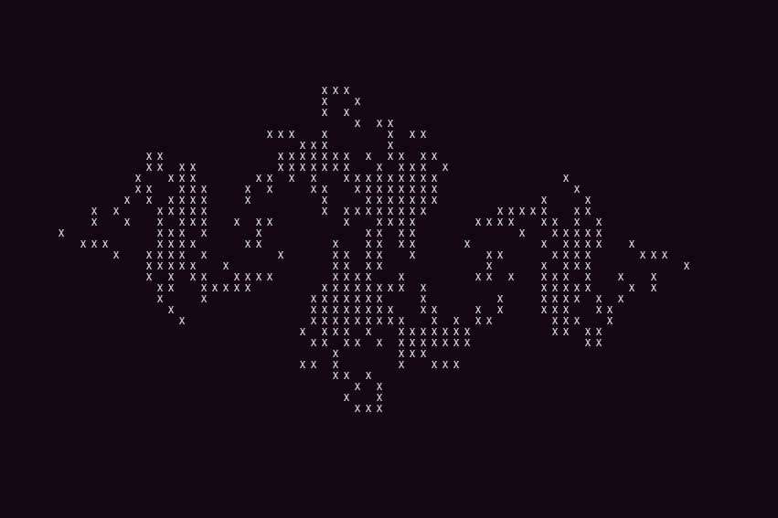

# Fractals - Mandelbrot and Julia Set

A fractal is a never-ending pattern. Fractals are infinitely complex patterns that are self-similar across different scales. They are created by repeating a simple process over and over in an ongoing feedback loop. Driven by recursion, fractals are images of dynamic systems – the pictures of Chaos. Here we explore the Julia sets and Mandelbrot sets and visualising these fractals. Complex numbers are imaginary numbers which involve the square root of -1. Plotting squared complex numbers on a plane will give a line which travels to either infinity or the origin. The Mandelbrot set and the Julia sets are sets of points in the complex plane. The code in the repo will plot out the Mandelbrot and Julia sets onto the terminal and with an additional option of plotting the sets in matlab.

# About the Project

This project will be exploring the [Julia set](https://en.wikipedia.org/wiki/Julia_set#:~:text=four%20different%20classes.-,Equivalent%20descriptions%20of%20the%20Julia%20set,.) (specifically the fillled-in quadratic Julia set) and the Mandelbrot set. The following is the definition of the Julia set given in [Wolfram MathWorld](https://mathworld.wolfram.com/JuliaSet.html):

Let *R(z)* be a rational function

$$ R(z) =  \frac{P(z)}{Q(z)} $$
where $z \in \mathbb{C}^*$, $\mathbb{C}^*$ is the Riemann sphere $\mathbb{C}\cup\{\infty\}$, and $P$ and $Q$ are polynomials without common divisors. The ''filled-in'' Julia set $J_{R}$ is the set of points $z$ which do not approach infinity after $R(z)$ is repeatedly applied (corresponding to a strange attractor).

A popular complex dynamical system is given by the family of complex quadratic polynomials, a special case of rational maps. Such quadratic polynomials can be expressed as:

$$ f_c(z) = z^2 + c \>,$$
where c is a complex number. This polynomial can be rewritten as the quadratic mapping:
$$ 	z_{n+1} = z_{n}^{2} + c  $$


for fixed c, where zn is a complex number, which is used to generate the quadratic Julia set. For almost every value of c, this mapping generates a fractal.

The Mandelbrot set is closely related to the Julia set. The Mandelbrot set is the set of values of c in the complex plane for which the orbit of 0 under the iteration of the quadratic map: 

$$ 	z_{n+1} = z_{n}^{2} + c  $$
remains bounded. That is, a complex number c is part of the Mandelbrot set if, when starting with $z_0 = 0$
and applying the iteration repeatedly, the absolute value of $z_n$ remains bounded however large n gets.

<center>

| | | |
|--------------|----------|----------|
| (− 2 + 2*i*) | (0+2*i*) | (2+2*i*) |
| (−2 + 0*i*)    | (0+0*i*)   | (2+0*i*)|
| (−2 − 2*i*)    | (0 − 2*i*) | (2 − 2*i*) |

</center>

x values that corresponds to each element. The domain is [−2 − 2i, 2 + 2i].

---
## Getting Started
These instructions will get you a copy of the project up and running on your local machine for development and testing purposes. See compliation for notes on how to deploy the project on a live system.

---

## Prerequisites

1. Either `Sudo apt`, `Brew `or any Package Manger
2. `g++/gcc` (If you need any help check installtion.)
3. Option: You can have `make` to compile and run the code (If you need any help check installtion.)
   
---

## Installation
**Install GCC/G++ on macOS**\
**Note: If you have XCode you already have gcc/g++ installed.**

1. Open Terminal.app, you can search for it in the Spotlight Search
2. Go to Homebrew Website in your browser, follow the instructions to install homebrew
3. Once it is installed, first use brew update to make sure it has the latest package database
4. Finally, use `brew install gcc` to install GCC, which contains the C++ compiler g++
5. To validate type `gcc --version`


**Install GCC/G++ on Linux**
1. Open Terminal
2. `sudo apt update`
3. `sudo apt install build-essential`
4. `sudo apt-get install manpages-dev`
5. To validate type `gcc --version`


---
## Structure
```text
. Fractal
├── Makefile
├── include
│  └── Fractal.h
│  └── ComplexNumber.h
└── src
    ├── Fractal.cpp
    ├── ComplexNumber.cpp
    └── main.cpp
```

---
## Compliation
<p>Below is how to run it through a makefile</p>

**Note: Make sure you're in the appropriate directory when compling.**\

```bash
make 
./output pos_x pos_y
```
Takes in two command line arguments to determine the size of the Mandelbrot and Julia set. pos_x and y refers to an int.
Recommended output for terminal pos_x = 80, pos_y = 80. 
Recommended output to plot the graph in pos_x = 720, pos_y = 720.\
**Note: if you want to remove the .o files and the exectuable run `make clean`** 
## GIF TO DEMONSTRATE COMPLIATION AND DEPLOYMENT


---
## Output
After compling the code above you should see the following in the terminal (depending on the size of mandelbrot and julia set you chose).You will also get two .dat files in which you can use to plot the mandelbrot and julia set in any ploting library you want. I provided matlab code to produce the plots below.

### TERMINAL PLOTS



### MATLAB PLOTS


---
## Contact

```text
Email: aelfarr2@gmail.com
Linkedin: /in/ahmed/el-farra
```
## Acknowledgements
---
* Special thanks to my University Professor Eunice Chan for guiding and showing me this project and providing the decription of this project.
* [Guide to Scientific Computing in C++ by Joe Pitt-Francis & Jonathan Whiteley](https://link.springer.com/book/10.1007/978-3-319-73132-2)